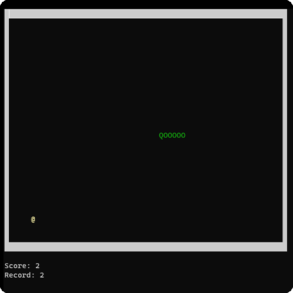
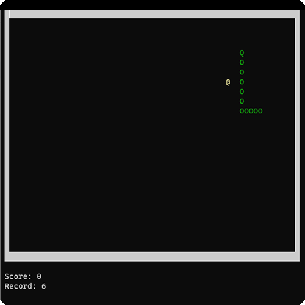

# MASM32 Snake Game :snake: 
The snake game written in assembly language using Kip Irvine’s **Irvine32** library. 
This game was a side project I worked on during my second year at university studying Systems Programming. 
You may direct the snake using the keyboard's directional arrow keys.
## Screenshots

